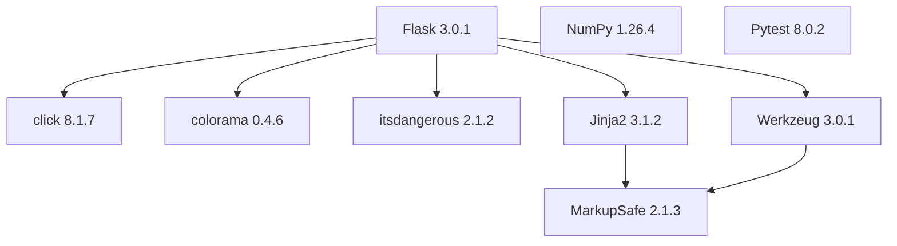

# Python Calculator API

Este é um projeto de API de calculadora desenvolvido em Python utilizando o framework Flask.

## 🚀 Tecnologias

- Python 3.x
- Flask 3.0.1
- NumPy 1.26.4
- Pytest 8.0.2

## 📦 Estrutura do Projeto

```
.
├── src/
│   ├── calculators/
│   ├── drivers/
│   ├── errors/
│   ├── main/
│   │   ├── routes/
│   │   │   └── calculators.py
│   │   └── server/
│   │       └── server.py
├── requirements.txt
├── interface_raw.py
└── run.py
```

## 🔧 Instalação

1. Clone o repositório
2. Crie um ambiente virtual:
```bash
python -m venv .venv
```

3. Ative o ambiente virtual:
```bash
# No Windows
.venv\Scripts\activate

# No Linux/Mac
source .venv/bin/activate
```

4. Instale as dependências:
```bash
pip install -r requirements.txt
```

## 🚀 Executando o Projeto

Para iniciar o servidor, execute:

```bash
python run.py
```

O servidor será iniciado em `http://localhost:5001`

## 🧪 Testes

O projeto utiliza Pytest para testes. Para executar os testes:

```bash
pytest
```

## 📦 Árvore de Dependências

### Diagrama de Dependências


### Lista de Dependências
```
Flask==3.0.1
├── click==8.1.7
├── colorama==0.4.6
├── itsdangerous==2.1.2
├── Jinja2==3.1.2
│   └── MarkupSafe==2.1.3
└── Werkzeug==3.0.1
    └── MarkupSafe==2.1.3
NumPy==1.26.4
Pytest==8.0.2
```

## 📝 Licença

Este projeto está sob a licença MIT. 